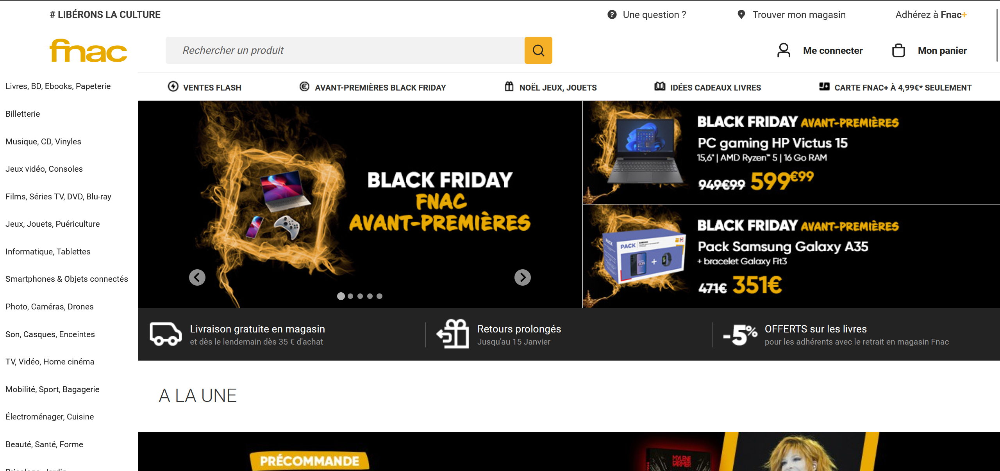
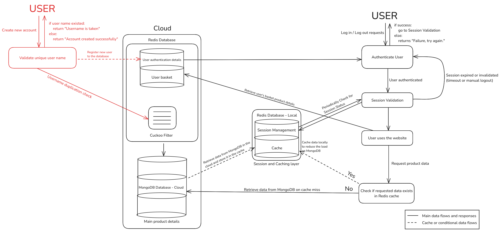

# Enhancing E-Commerce Platform Performance: Integrating Redis for Session Management and MongoDB for Flexible Product Data Storage
## Abstract
This report explores the implementation of Redis and MongoDB to optimize an e-commerce platform that sells technology products. The primary problem addressed is the system's inefficiency in handling user login sessions and product catalog storage, which relies on a relational database and results in slow response times and limited flexibility. 

Redis was integrated to handle login session management, enabling faster, low-latency access to user credentials, while MongoDB was employed to manage product information due to its document-oriented structure, which accommodates a wide variety of product attributes.

By implementing these technologies, the platform achieved significantly reduced login times and improved data flexibility, as Redis's in-memory storage accelerated authentication and MongoDB allowed dynamic schema adjustments for different product types. These results demonstrate that Redis and MongoDB can enhance user experience and speed up development by resolving the performance limitations of traditional relational databases.

**The integration of these tools offers a scalable solution for e-commerce platforms seeking both high performance and adaptability in managing divers, high-volume data.**

## Context
In the rapidly evolving world of e-commerce, the website's mission is to offer a comprehensive range of high-quality tech products, including laptops, smartphones, accessories, and other electronics, aimed at tech enthusiasts and everyday consumers alike. As the platform expands to accommodate an ever-growing catalog, maintaining a seamless user experience is a top priority.

Users expect a fast, reliable, and intuitive shopping experience - from creating accounts and browsing products to completing purchases without delays or disruptions.

Given the highly competitive nature of online retail, any friction in the user experience, particularly around login and browsing, can lead to user dissatisfaction and potential loss of revenue.

**The website aims to create an engaging and smooth interface where users can interact effortlessly with the platform's features, find products tailored to their needs, and complete transactions quickly.**

The image above shows that *fnac.com* features an interface displaying product information, along with options for logging in and accessing the user’s shopping basket. I aim to implement the data retrieval process, session management, and a basic user inventory system.
## Problem Statement
Three primary challenges have been identified that impact the platform's performance and user experience: slow login speed, the need for flexible data management for the product catalog and the website load time.
- **Login Speed**: if we implement the platform's login process with a traditional relational database to manage user credentials and session data, we will introduces latency when high volumes of users attempt to log in simultaneously, resulting in a poor experience for users who expect less than one or two second access. *As the website scales, this bottleneck could lead to significant performance degradation, with delays affecting the site's ability to meet peak demand efficiently.*
- **Flexible Product Data Management**: the second challenge lies in managing the diversity of product attributes and specifications within the tech catalog. Tech products come with various configurations, such as memory capacity, processing power, and compatibility specifications, which require a flexible and scalable way to store and retrieve product data. Using a relational database to manage such diverse data introduces rigidity, as changes in product attributes necessitate schema adjustments that slow down the update process and complicate data queries. This structure makes it difficult for the platform to adapt quickly to new product types or attribute variations, which is essential for staying competitive in the fast-paced tech market. *Therefore, an implementation of NoSQL is necessary to manage such data efficiently.*
- **Website Load Time**: Navigating back and fourth in the website can be resource intensive, we want to avoid continuously reloading the website data. *We need a cache to store the already downloaded data so that we can ensure a faster website loading time.*
## Objective
To address these challenges, this project proposes an optimized architecture for the e-commerce platform, focusing on three key improvements: Redis integration for login session management, MongoDB for product data storage and Redis for caching data.
1. **Redis for Efficient Login Session Management**: Redis, as in-memory key-value store, will replace the relational database for handling user login sessions. Its low-latency operations make it ideal for high speed session management, allowing users to access their accounts almost instantaneously. By managing sessions with Redis, the platform can reduce login times significantly and support high-volume access without performance bottlenecks, leading to a more responsive and satisfying user experience.
2. **MongoDB for Flexible Product Data Storage**: To support the wide variety of tech product specifications, MongoDB will be used for storing product information in a document-oriented structure. MongoDB's flexible schema allows each product to be represented as a JSON-like document, enabling easy updates and adaptations to product attributes without modifying the overall schema. This flexibility will streamline data management, making it easier to introduce new products, modify specifications, and perform complex queries based on product attributes, all of which contribute to a more efficient and scalable catalog management system.
3. **Redis for caching data**: Caching already downloaded data in Redis allowed for fast retrieve from the memory rather than querying the database, thus enabling a fast and seamless respond.

Below is the diagram for the design of **System Architecture for User Authentication, Session Management, and Caching** of my implementation.
- Red elements: Registration Process
- Black elements: User Session and Data Query Processes

## Materials
**Why choose Redis to manage session and caching data?**

**Schema**: Key-value storage is applied where each Redis key represents specific user data (e.g., user:<username>:password for password storage, session:<session_id> for session management). This schema-less approach is advantageous because it allows rapid storage and retrieval without the need for strict data structure definitions.

1. High Performance and Low Latency
- In-memory Storage: REdis stores data in memory rather than on disk, making it exceptionally fast. This feature is critical for use cases like session management, caching frequently accessed data, and real-time analytics, where low-latency responses are necessary.
- Throughput: Redis can handle millions or read and write requests per second, which is beneficial for high-traffic applications where speed directly impacts user experience
2. Rich Data Structures
- Redis supports a variety of data types beyond simple key-value pairs. These structures enable Redis to handle complex data interactions in a way that most traditional caches do not 
3. Flexible Caching Strategies
- Redis allows setting expiration times on keys, making it easy to control cache freshness. This is perfect for us since we want rely on time-based cache invalidation to keep our contents up-to-date
4. Simple to Use and Integrate
- Redis is easy to set up and integrates seamlessly with various programming languages and frameworks, making it accessible for a wide range of applications.
5. Cost-Effectiveness
- Redis is open-source, meaning there's no licensing cost. Additionally, its high performance and lightweight memory footprint can reduce the need for additional infrastructure, lowering operational costs

**Why choose MongoDB and not CockroachDB for managing product detail?**
1. Flexible Schema
- MongoDB: it's designed to handle unstructured or semi-structured data. MongoDB uses a document-oriented structure, where each product can be stored as a JSON-like document (BSON). This is ideal for our website with a diverse catalog of tech products that may vary significantly in attributes (e.g., laptops, phones, accessories with different specifications). MongoDB's schema flexibility means you can easily add, modify, or remove product attributes without altering the underlaying database schema.
- CockroachDB: As a SQL-based, strongly consistent relational database, CockroachDB has a more rigid schema, making it less adaptable to changes in product attributes. Altering the schema to accommodate new product fields could be more cumbersome, and may require additional maintenance.
2. Ease of Scaling for Large Product Catalogs
- MongoDB: It's known for its horizontal scalability and was built with a NoSQL architecture, making it simple to scale out by adding more nodes. This aligns well with handling extensive, varied product catalogs where you might need to manage a large volume of data across distributed systems.
- CockroachDB: Although CockroachDB also offers horizontal scalability and resilience, it primarily emphasizes transactional consistency and distributed SQL operations. This can add complexity for applications focused mainly on storing and retrieving non-transactional, flexible data structures like product information.
3. Querying and Indexing Flexibility
- MongoDB: It's querying capabilities are designed for document-based storage, allowing for querying deeply nested data, making it simple to scale out by adding more nodes. This aligns well with handling extensive, varied product catalogs where we might need to manage a large volume of data.
- CockroachDB: While CockroachDB supports SQL queries and indexing, it doesn't natively support document-based, nested queries to the same extent. MongoDB's ability to handle complex, multi-attribute search requirements makes it better suited for an e-commerce environment where product filtering and attribute-based searches are essential.
4. Rapid Development and Flexibility
- MongoDB: For an e-commerce platform where new products and categories may be introduced frequently, MongoDB allows rapid development with minimal schema constraints. This can accelerate product launches and simplify update, which are common in tech-focused e-commerce platforms.
- CockroachDB: CockroachDB shines with distributed, ACID-compliant SQL transactions across multiple nodes. This strength is useful in applications that require strict consistency (like financial applications), but it can add overhead for applications primarily focused on storing product data that doesn't need distributed transactions.
